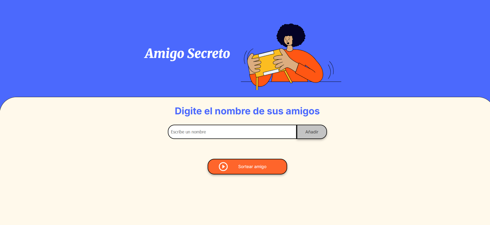
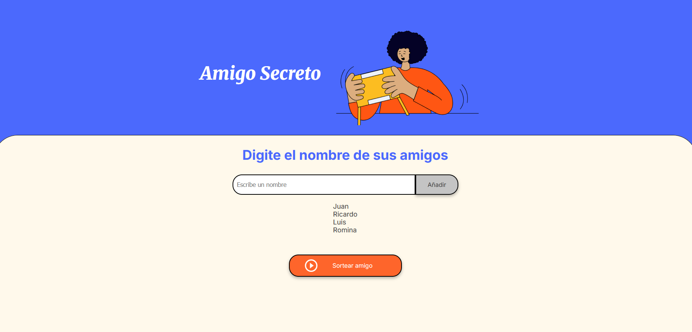
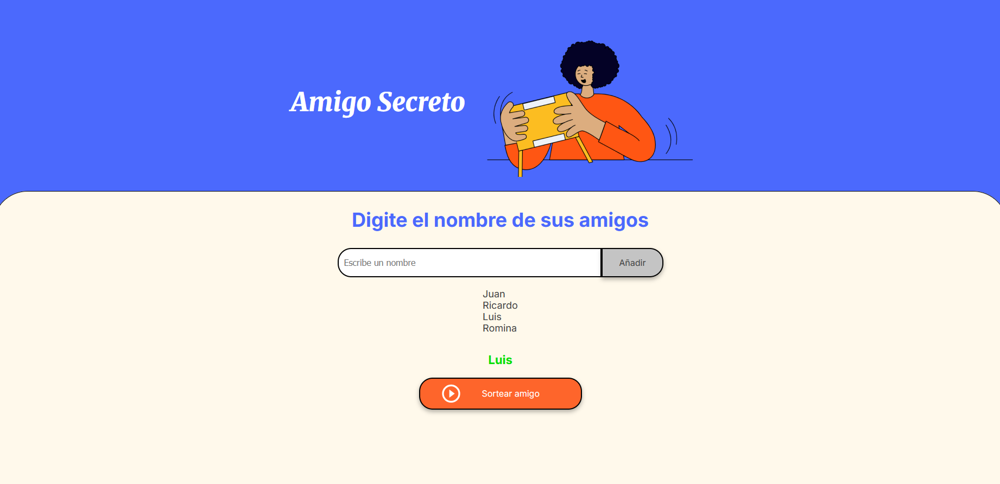

# 🎁 Amigo Secreto

[]()
[]()

Aplicación web que permite organizar fácilmente un sorteo de **Amigo Secreto**.  
El usuario ingresa una lista de participantes y el sistema selecciona un nombre de manera aleatoria.  

---

## ✨ Características

- 📝 Ingreso de nombres de manera dinámica.  
- 🎲 Sorteo aleatorio de un participante.  
- 👀 Interfaz simple, clara y fácil de usar.    

---

## 📸 Capturas de pantalla

| Pantalla inicial | Lista de nombres | Resultado |
|------------------|------------------|-----------|
|  |  |  |

---

## 🛠️ Tecnologías utilizadas

- **HTML5**  
- **CSS3**  
- **JavaScript**  

---

## ⚡ Instalación y uso

1. Clona este repositorio:  
   ```bash
   git clone https://github.com/jcesarcorrea/challenge-amigo-secreto.git
